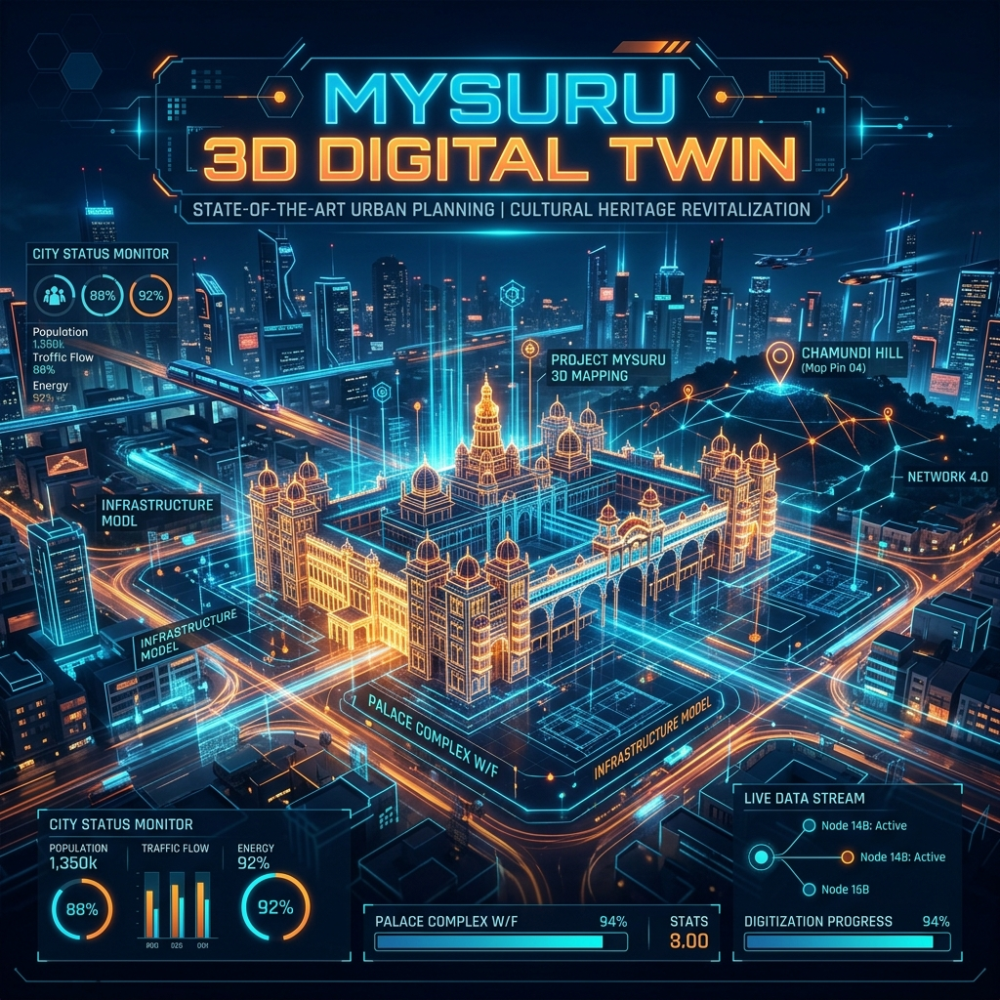

# 🏙️ Bengaluru Nexus: 3D Digital Twin Command Center v4.2



## 📡 PROJECT OVERVIEW
**Bengaluru Nexus** is a state-of-the-art, high-fidelity urban simulation and management platform. Designed as a "God Mode" interface for the Silicon Valley of India, it synthesizes real-world geospatial data, 3D architectural footprints, and critical utility infrastructure into an immersive, browser-based integrated command center.

Built for urban planners, emergency responders, and policy makers, the platform leverages advanced GIS technologies and Agent-Based Modeling (ABM) to provide deep insights into infrastructure resilience, environmental health, and citizen sentiment.

---

## 🚀 CORE CAPABILITIES

### 🏆 1. STRATEGIC MISSION CONTROL (Zoning & Urban Planning)
*   **3D Building HUD**: Interactive extruded footprints with precise architectural metadata.
*   **🏗️ Impact Simulation**: Revolutionary "What If" analysis. Simulate building removal or new infrastructure and instantly analyze the ripple effect on surrounding utilities and traffic.
*   **📊 Triple Win Scorecard**: Real-time tracking of **Economic**, **Social**, and **Environmental** metrics.
*   **🌿 Decision Confidence Meter**: AI-driven score that predicts the overall success and risk of administrative interventions.

### 🎭 2. CITIZEN PULSE & SOCIAL HEURISTICS
*   **🎭 Sentiment Heatmaps**: Visualization of real-time "Mood" across Bengaluru's wards using social telemetry.
*   **Mood Visualization**: Dynamic heatmap where **Red** indicates high friction/complaints and **Green** indicates high satisfaction.
*   **Global Policy Broadcast**: Deploy city-wide directives and monitor citizen response in real-time.

### 🌊 3. CRISIS RESPONSE HUB
*   **🌊 Flood Inundation Model**: High-precision 3D flood simulator (0-15m depth). Buildings are color-coded based on critical risk thresholds.
*   **🚑 Disaster Routing**: Real-time EMS unit pathfinding and hydrant mapping for rapid emergency response.
*   **⚡ Predictive Failure Analysis**: Uses Storm Intensity metrics to predict where power grids or structural points are most likely to fail.

### 🧠 4. NEXUS AI ADVISOR (Policy Support)
*   **🤖 SYNT-GOV AI**: An integrated Policy Advisor for fiscal and social impact auditing.
*   **Conflict Resolver**: Automatically detects and proposes resolutions for inter-departmental conflicts (e.g., Road Dept vs Water Dept).
*   **Scenario Battle Mode**: Compare different urban development options (e.g., Flyover vs Metro Link) in a high-fidelity side-by-side simulation.

---

## 🛠️ TECHNICAL ARCHITECTURE

The platform is built on a **Premium Geospatial Stack**:

*   **Frontend**: Next.js 16+ for professional-grade routing and SEO-optimized portal management.
*   **Graphics Engine**: Deck.gl & MapLibre GL for 60fps 3D rendering of complex city-scale datasets.
*   **Animation Engine**: Framer Motion for premium HUD transitions and rhythmic UI pulses.
*   **Backend**: Node.js Express service powering Simulation, Sentiment, and Impact Analytics.
*   **UI/UX**: "Midnight Tech" Aesthetic – high-contrast glassmorphism with cobalt-blue accents.

---

## ⚙️ INSTALLATION & RUNNING

### Prerequisites
*   Node.js (v18+)
*   npm or yarn

### 1. Project Initialization
```bash
# Install all dependencies (Client & Server)
npm run install:all
```

### 2. Launch Development Environment
```bash
# Start both Server (3001) and Client (9000)
npm run dev
```
*   **🏙️ Admin Nexus**: [http://localhost:9000/admin](http://localhost:9000/admin)
*   **📡 Analysis Service**: [http://localhost:3001/api](http://localhost:3001/api)

---

## 📂 PROJECT STRUCTURE
```bash
├── client/              # Next.js 3D Integrated Interface
│   ├── app/            # App Router (Admin, User, Portal pages)
│   ├── components/     # High-fidelity React components (HUD, Map)
│   └── public/         # Static GIS Assets & Data
├── server/              # Node.js Express Command Core
│   └── index.js        # Simulation & Analytics Endpoints
├── data/                # Master GeoJSON datasets for Bengaluru
└── assets/              # Branding & UI Assets
```

---

## 👤 AUTHOR
**Bharath Kumara**
*   *Digital Twin Architect & Geospatial Engineer*

---

> *"The future of urban governance is not in papers, but in pixels."* - **BENGALURU NEXUS CMD v4.2**
